### 1. Несоответствие города поисковому запросу

**Приоритет:** P1 - Высокий. Блокирует релевантный поиск для пользователя.  
**Описание:** При активном фильтре «Москва» и заголовке «Котята в Москве», первым в выдаче отображается объявление из
Новосибирска.  
**Ожидаемый результат:** В выдаче присутствуют только объявления, соответствующие выбранному региону.  
**Cкриншот:**  
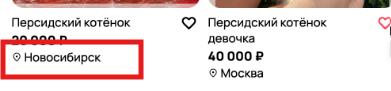

### 2. Несоответствие сортировки по цене

**Приоритет:** P1 - Высокий. Блокирует релевантный поиск для пользователя.  
**Описание:** При активном заданном диапазоне цен показывает объявления, которые ниже/выше ценового диапазона.  
**Ожидаемый результат:** В выдаче присутствуют только объявления, соответствующие выбранному ценовому диапазону.  
**Cкриншот:**  
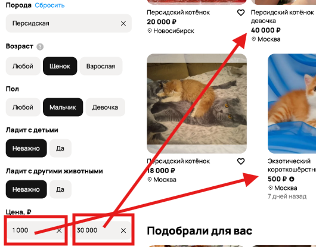

### 3. Несоответствие пола в поиске

**Приоритет:** P1 - Высокий. Блокирует релевантный поиск для пользователя.  
**Описание:** При выбранном фильтре "мальчик" отображаются объявления, где находятся кошки.  
**Ожидаемый результат:** В выдаче присутствуют только объявления, в которых пол животного соответствует фильтру.  
**Cкриншот:**  
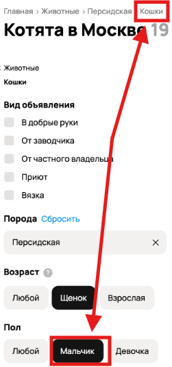

### 4. Невалидный фильтр в поиске

**Приоритет:** P1 - Высокий. Блокирует релевантный поиск для пользователя.  
**Описание:** При выбранной категории "Животные" отображается фильтр "Вязка".  
**Ожидаемый результат:** В выдаче отсутствует фильтр "Вязка".  
**Cкриншот:**  
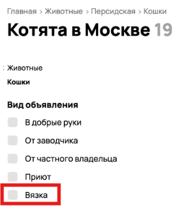

### 5. Неправильное отображение вида кошки

**Приоритет:** P1 - Высокий. Блокирует релевантный поиск для пользователя.  
**Описание:** Отображается кошка не персидского вида.  
**Ожидаемый результат:** В выдаче присутствуют только персидские кошки.  
**Cкриншот:**  
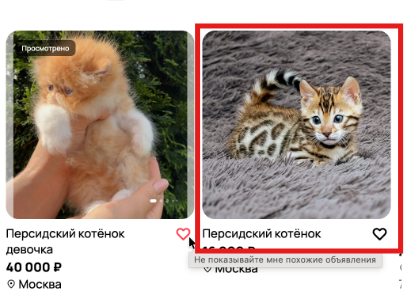

### 6. Отображается неправильный город в переключателе

**Приоритет:** P1 - Высокий. Блокирует релевантный поиск для пользователя.  
**Описание:** Отображается город Можайск на переключателе, хотя выбран город Москва.  
**Ожидаемый результат:** Переключатель имеет значение Москвы.  
**Cкриншот:**  
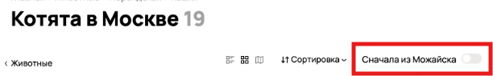

### 7. Отображается игрушечная кошка

**Приоритет:** P1 - Высокий. Блокирует релевантный поиск для пользователя.  
**Описание:** Отображается игрушечная кошка, хотя выбраны животные.  
**Ожидаемый результат:** В объявлениях отсутствуют неживые существа.  
**Cкриншот:**  
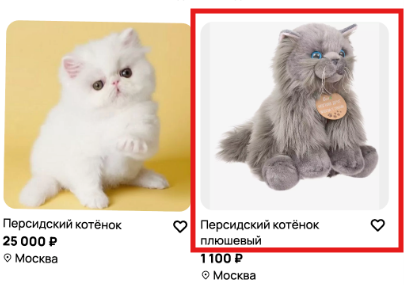

### 8. Отображается неправильный город в переключателе

**Приоритет:** P2 - Средний. Вводит в заблуждение, не блокируя основной поиск.  
**Описание:** Отображается город Можайск на переключателе, хотя выбран город Москва.  
**Ожидаемый результат:** Переключатель имеет значение Москвы.  
**Cкриншот:**  

### 9. Отображается неправильный город в переключателе

**Приоритет:** P2 - Средний. Вводит в заблуждение, не блокируя основной поиск.  
**Описание:** Неправильно отображается кол-во объявлений.  
**Ожидаемый результат:** Кол-во объявлений отображаются корректно.  
**Cкриншот:**  
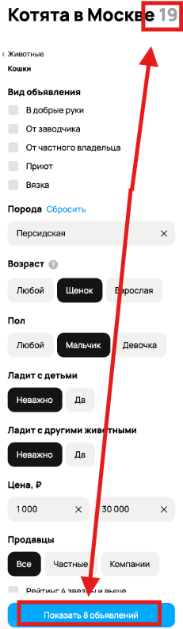

### 10. Отображается фильтр щенок

**Приоритет:** P2 - Средний. Вводит в заблуждение, не блокируя основной поиск.  
**Описание:** Отображается фильтр "Щенок" вмесо "Котенок".  
**Ожидаемый результат:** Возраст кошек отображается как "Котенок".  
**Cкриншот:**  
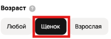

### 11. При наводке на сердечко отображается неверное описание

**Приоритет:** P3 - Низкий. Визуальный дефект, не влияющий на функциональность.  
**Описание:** Отображается неверное описание для сердечка.  
**Ожидаемый результат:** Сердечко возле кошки отображает "Добавить в избранное".  
**Cкриншот:**  
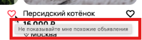

### 12. Поплыл интерфейс карточек

**Приоритет:** P3 - Низкий. Визуальный дефект, не влияющий на функциональность.  
**Описание:** Отображается кривой интерфейс.  
**Ожидаемый результат:** Интерфейс выровнен.  
**Cкриншот:**  
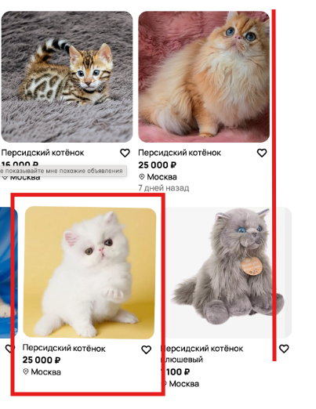

### 13. Отображается ошибка в интерфейсе

**Приоритет:** P3 - Низкий. Визуальный дефект, не влияющий на функциональность.  
**Описание:** Отображается сообщение об ошибке.  
**Ожидаемый результат:** Сообщение об ошибке не отображается.  
**Cкриншот:**  
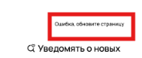

